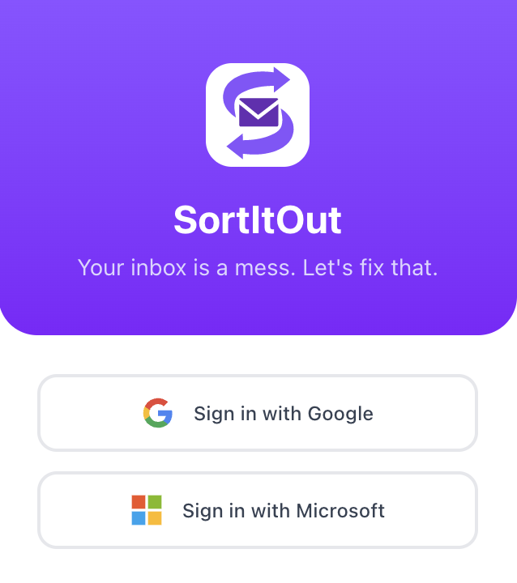
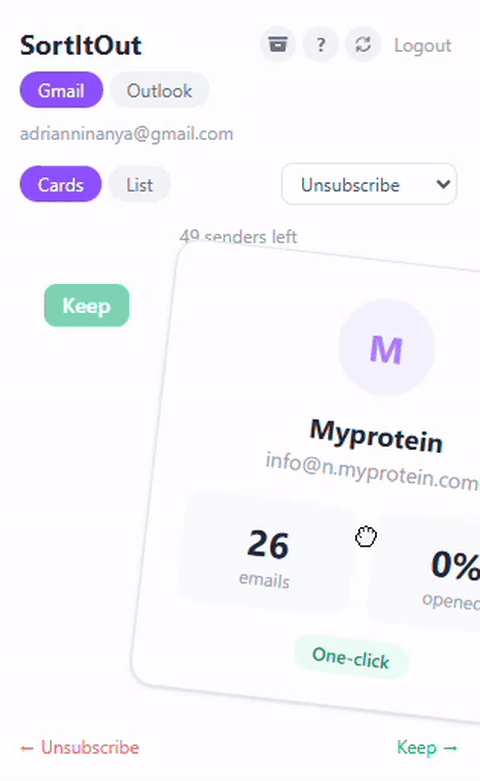
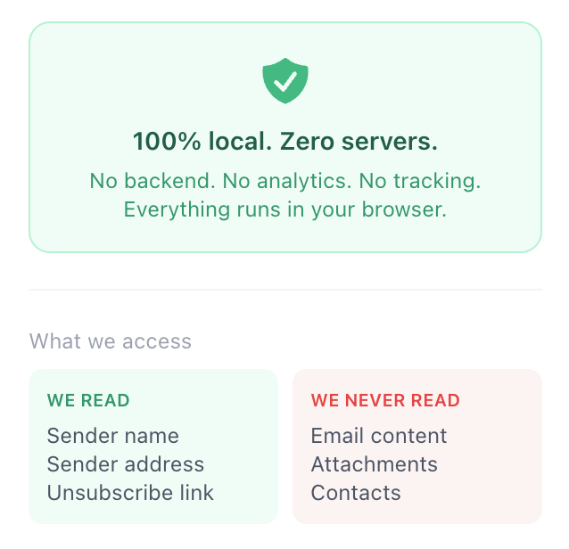
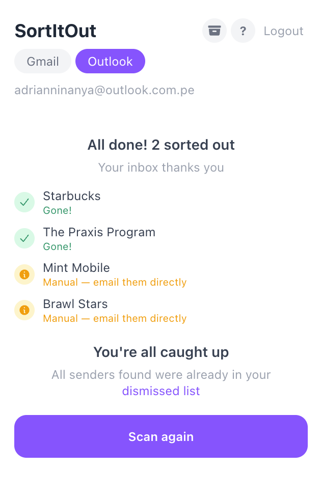

<p align="center">
  
</p>

<h1 align="center">SortItOut</h1>

<p align="center">
  A Chrome extension that helps you clean up your <b>Gmail</b> and <b>Outlook</b> inbox by surfacing the senders of newsletters and promotional emails, then letting you <b>unsubscribe or trash them with a swipe</b>.
  <br>
  Built with <b>React 19, TypeScript, Vite, Tailwind v4, and Manifest V3</b>.
  <br><br>
  Everything runs locally on your device. No backend, no analytics, no tracking.
</p>

<p align="center">
  <a href="https://chromewebstore.google.com/detail/sortitout/flffhjccncnnphgfkpjjjioebmdcnied">
    
  </a>
</p>

---

## Demo

<table align="center">
  <tr>
    <td align="center" valign="middle">
      
    </td>
    <td align="center" valign="middle">
      
    </td>
  </tr>
  <tr>
    <td align="center"><sub><b>Sign-in screen</b></sub></td>
    <td align="center"><sub><b>Swiping through senders</b></sub></td>
  </tr>
  <tr>
    <td align="center" valign="middle">
      
    </td>
    <td align="center" valign="middle">
      
    </td>
  </tr>
  <tr>
    <td align="center"><sub><b>Privacy announcement</b></sub></td>
    <td align="center"><sub><b>Results summary</b></sub></td>
  </tr>
</table>

> [!IMPORTANT]
> SortItOut is currently going through Google's OAuth verification process. The first time you sign in with Google you may see a **"this app is not verified by Google"** warning. Click **Advanced → Go to SortItOut (unsafe)** to proceed. This is expected while verification is pending and will go away once the process completes.

---

## Features

| Feature | What it does |
|---|---|
| **Two-provider support** | Sign in with Gmail or Outlook (or both, with separate auth state per provider). |
| **One-click unsubscribe** | Detects senders that support the standard `List-Unsubscribe` and `List-Unsubscribe-Post` headers (RFC 2369 / RFC 8058) and unsubscribes you with a single HTTPS POST. No redirect needed. |
| **Swipe-to-trash** | Swipe a sender card to move every email from that sender into Trash in one action. |
| **Three swipe modes** | Unsubscribe-only, trash-only, or both at the same time. |
| **Card and list views** | Choose a Tinder-style card stack or a checklist for batch actions. |
| **Open-rate hint** | Each sender card shows a rough open rate (read vs. unread) so you know which senders you actually engage with. |
| **Dismissed list** | Senders you've reviewed don't reappear next time you scan, with optional cooldowns. |
| **Local-only** | All scan results, dismissed senders, and Outlook tokens live in `chrome.storage.local` and are deleted when the extension is uninstalled. |

---

## Tech stack

- **Framework:** React 19 + TypeScript
- **Build:** Vite 7
- **Styling:** Tailwind CSS v4
- **Animations:** [`motion`](https://motion.dev) (formerly Framer Motion)
- **Extension platform:** Chrome Manifest V3 (service worker + popup)
- **APIs:** Gmail API (`gmail.modify`), Microsoft Graph (`Mail.ReadWrite`)
- **Auth:** `chrome.identity.getAuthToken` for Gmail, `chrome.identity.launchWebAuthFlow` + PKCE for Outlook

---

## Local development

### 1. Prerequisites

- [Node.js](https://nodejs.org/) 20+ and npm
- A Chromium-based browser (Chrome, Edge, Brave, Arc)

### 2. Clone and install

```bash
git clone https://github.com/NinyaDev/SortItOut-Extension.git
cd SortItOut-Extension
npm install
```

### 3. Build the extension

```bash
npm run build
```

This outputs the production bundle to `dist/`.

### 4. Load it in Chrome

1. Go to `chrome://extensions`
2. Toggle **Developer mode** on (top right)
3. Click **Load unpacked** and select the `dist/` folder
4. The SortItOut icon will appear in your toolbar

### 5. Wire up your own OAuth clients (optional)

The published `manifest.json` ships with the OAuth client IDs used by the live Chrome Web Store build. If you want to develop against your own Google or Microsoft tenants:

- **Gmail:** create an OAuth Client of type *Chrome Extension* in the [Google Cloud Console](https://console.cloud.google.com/apis/credentials), set its Application ID to your unpacked extension ID, and replace `client_id` in `public/manifest.json`.
- **Outlook:** register a single-page app in the [Azure Portal](https://portal.azure.com), add `https://<extension-id>.chromiumapp.org/` as a redirect URI, and replace `CLIENT_ID` in `src/logic/outlook-auth.ts`.

---

## Project structure

```
.
├── public/
│   ├── manifest.json          # MV3 manifest (permissions, OAuth, icons)
│   └── icons/                 # Extension logos (16/48/128)
├── src/
│   ├── App.tsx                # Popup root: provider state, scan UI
│   ├── main.tsx               # React entry point
│   ├── index.css              # Tailwind + Inter font
│   ├── background/
│   │   └── index.ts           # Service worker: unsubscribe POST + Outlook auth
│   ├── logic/
│   │   ├── gmail.ts           # Gmail API calls
│   │   ├── outlook.ts         # Microsoft Graph calls
│   │   ├── outlook-auth.ts    # Outlook OAuth + PKCE
│   │   ├── scanner.ts         # Gmail two-phase sender scan
│   │   ├── outlook-scanner.ts # Outlook sender scan
│   │   ├── parser.ts          # List-Unsubscribe header parsing
│   │   ├── unsubscribe.ts     # One-click / link / mailto handler
│   │   ├── dismissed.ts       # Dismissed-sender list + cooldowns
│   │   └── types.ts           # Shared types
│   └── ui/
│       ├── SwipeableCard.tsx  # Motion-driven swipe gesture
│       ├── AnimatedList.tsx   # List view
│       ├── InfoPanel.tsx      # Help / privacy info
│       ├── DismissedPanel.tsx # Manage dismissed senders
│       └── SenderSkeleton.tsx # Loading state
├── popup.html                 # Extension popup entry HTML
├── vite.config.ts             # Vite + extension build config
└── PRIVACY.md                 # Privacy policy (also published at the GitHub Pages site)
```

---

## Privacy

SortItOut reads only email headers (sender, `List-Unsubscribe`) and basic metadata. Bodies, attachments, and contacts are never accessed. All data stays on your device. Read the [full Privacy Policy](https://ninyadev.github.io/SortItOut-Extension/PRIVACY).

---

## Verification status

Google OAuth verification for the `gmail.modify` scope is in progress:

- ✅ Branding verified
- ⏳ Data Access (restricted scope) verification, in beta under Google's 100-user cap

---

## License

Released under the [MIT License](./LICENSE).

---

## Contact

**Adrian Ninanya**

* **GitHub:** [NinyaDev](https://github.com/NinyaDev)
* **LinkedIn:** [Adrian Ninanya](https://www.linkedin.com/in/adrian-ninanya/)
* **Project Link:** [https://github.com/NinyaDev/SortItOut-Extension](https://github.com/NinyaDev/SortItOut-Extension)
