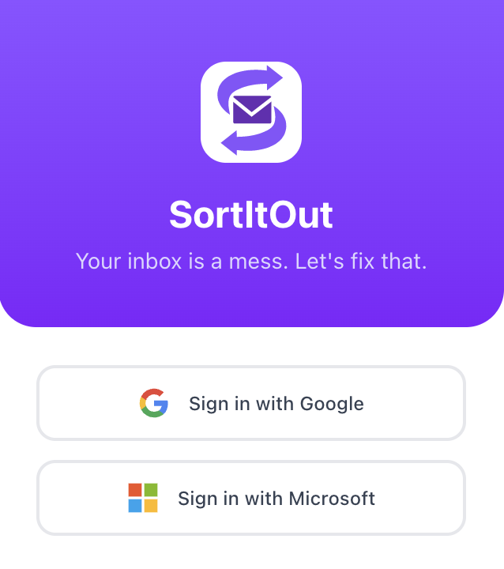
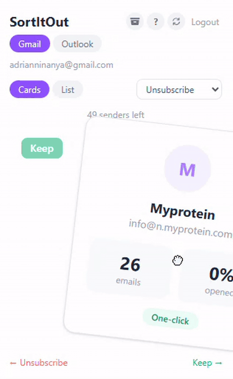
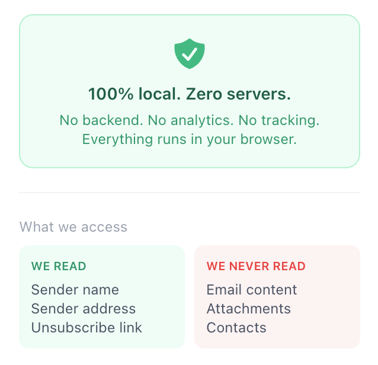
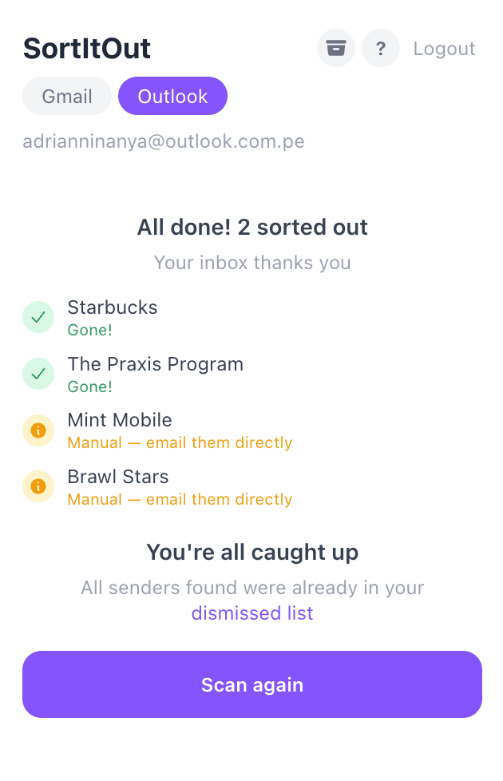

<p align="center">
  
</p>

<h1 align="center">SortItOut</h1>

<p align="center">
  A cross-browser extension that helps you clean up your <b>Gmail</b> and <b>Outlook</b> inbox by surfacing the senders of newsletters and promotional emails, then letting you <b>unsubscribe or trash them with a swipe</b>.
  <br>
  Built with <b>React 19, TypeScript, Vite, Tailwind v4, and Manifest V3</b>. Runs on Chrome, Edge, Brave, Vivaldi, Firefox, and Zen.
  <br><br>
  Everything runs locally on your device. No backend, no analytics, no tracking.
</p>

<p align="center">
  <a href="https://chromewebstore.google.com/detail/sortitout/flffhjccncnnphgfkpjjjioebmdcnied">
    
  </a>
  &nbsp;
  <a href="https://addons.mozilla.org/addon/sortitout/">
    
  </a>
</p>

---

## Demo

<table align="center">
  <tr>
    <td align="center" valign="middle">
      
    </td>
    <td align="center" valign="middle">
      
    </td>
  </tr>
  <tr>
    <td align="center"><sub><b>Sign-in screen</b></sub></td>
    <td align="center"><sub><b>Swiping through senders</b></sub></td>
  </tr>
  <tr>
    <td align="center" valign="middle">
      
    </td>
    <td align="center" valign="middle">
      
    </td>
  </tr>
  <tr>
    <td align="center"><sub><b>Privacy announcement</b></sub></td>
    <td align="center"><sub><b>Results summary</b></sub></td>
  </tr>
</table>

> [!IMPORTANT]
> SortItOut is currently going through Google's OAuth verification process. The first time you sign in with Google you may see a **"this app is not verified by Google"** warning. Click **Advanced → Go to SortItOut (unsafe)** to proceed. This is expected while verification is pending and will go away once the process completes.

---

## Features

| Feature | What it does |
|---|---|
| **Two-provider support** | Sign in with Gmail or Outlook (or both, with separate auth state per provider). |
| **One-click unsubscribe** | Detects senders that support the standard `List-Unsubscribe` and `List-Unsubscribe-Post` headers (RFC 2369 / RFC 8058) and unsubscribes you with a single HTTPS POST. No redirect needed. |
| **Swipe-to-trash** | Swipe a sender card to move every email from that sender into Trash in one action. |
| **Three swipe modes** | Unsubscribe-only, trash-only, or both at the same time. |
| **Card and list views** | Choose a Tinder-style card stack or a checklist for batch actions. |
| **Open-rate hint** | Each sender card shows a rough open rate (read vs. unread) so you know which senders you actually engage with. |
| **Dismissed list** | Senders you've reviewed don't reappear next time you scan, with optional cooldowns. |
| **Local-only** | All scan results, dismissed senders, and Outlook tokens live in `chrome.storage.local` and are deleted when the extension is uninstalled. |

---

## Tech stack

- **Framework:** React 19 + TypeScript
- **Build:** Vite 7
- **Styling:** Tailwind CSS v4
- **Animations:** [`motion`](https://motion.dev) (formerly Framer Motion)
- **Extension platform:** Manifest V3, cross-browser (Chromium service worker + Gecko background script fallback)
- **APIs:** Gmail API (`gmail.modify`), Microsoft Graph (`Mail.ReadWrite`)
- **Auth:**
  - Gmail on Chromium: `chrome.identity.getAuthToken` (Chrome Extension OAuth client)
  - Gmail on Firefox/Zen: `chrome.identity.launchWebAuthFlow` + PKCE (Web Application OAuth client)
  - Outlook on both: `chrome.identity.launchWebAuthFlow` + PKCE (Entra public client)

---

## Local development

### 1. Prerequisites

- [Node.js](https://nodejs.org/) 20+ and npm
- A Chromium-based browser (Chrome, Edge, Brave, Vivaldi) **and/or** a Gecko-based browser (Firefox 121+, Zen)

### 2. Clone and install

```bash
git clone https://github.com/NinyaDev/SortItOut-Extension.git
cd SortItOut-Extension
npm install
```

### 3. Build the extension

```bash
npm run build
```

This outputs the production bundle to `dist/`.

### 4a. Load it in a Chromium browser (Chrome, Edge, Brave, Vivaldi)

1. Go to `chrome://extensions` (or the equivalent in your browser)
2. Toggle **Developer mode** on (top right)
3. Click **Load unpacked** and select the `dist/` folder
4. The SortItOut icon will appear in your toolbar

The `key` field in `public/manifest.json` makes the unpacked build compute the same extension ID as the production CWS install, so the bundled OAuth client works out of the box. (Chrome Web Store strips the `key` field on submission and re-signs with its own key, so this is safe for both local dev and store distribution.)

### 4b. Load it in a Gecko browser (Firefox 121+, Zen)

1. Go to `about:debugging`
2. Click **This Firefox** (Zen shows it as "This Zen", same thing)
3. Click **Load Temporary Add-on** and pick `dist/manifest.json`
4. The SortItOut icon will appear in your toolbar

Note: temporary add-ons are removed when you close the browser. For a persistent install, use the [published AMO listing](https://addons.mozilla.org/addon/sortitout/) or sign the extension with your own AMO developer account.

### 5. Wire up your own OAuth clients (optional)

The published `manifest.json` and source code ship with the OAuth client IDs used by the live store builds. If you want to develop against your own Google or Microsoft tenants:

- **Gmail (Chromium):** create an OAuth Client of type *Chrome Extension* in the [Google Cloud Console](https://console.cloud.google.com/apis/credentials), set its Application ID to your unpacked extension ID, and replace `client_id` in `public/manifest.json` (`oauth2.client_id`).
- **Gmail (Firefox/Zen):** create a separate OAuth Client of type *Web Application*, add `chrome.identity.getRedirectURL()` (an `https://<hash>.extensions.allizom.org/` URL — get it from the extension's background console) as an Authorized Redirect URI, and replace `CLIENT_ID` in `src/logic/gmail-auth.ts`. Google's Web Application client type requires a client secret even with PKCE; put it in a gitignored `.env.local` file as `VITE_FIREFOX_GOOGLE_CLIENT_SECRET=...` and Vite will inject it at build time.
- **Outlook (both):** register a public client in the [Azure Portal](https://portal.azure.com), add both `https://<chrome-extension-id>.chromiumapp.org/` (for Chromium) and the Firefox `extensions.allizom.org` URI as redirect URIs, and replace `CLIENT_ID` in `src/logic/outlook-auth.ts`.

---

## Project structure

```
.
├── public/
│   └── manifest.json   # MV3 manifest (permissions, OAuth, icons, gecko id)
├── src/
│   ├── App.tsx         # Popup root, branches on browser for Gmail auth
│   ├── background/     # Service worker: unsubscribe POST + Outlook/Gmail PKCE
│   ├── logic/          # Gmail / Outlook API calls, auth modules, scanners,
│   │                   # parser, dismissed list
│   └── ui/             # Swipeable card, list view, info / dismissed panels
├── popup.html
├── vite.config.ts
└── .env.local          # gitignored. Holds VITE_FIREFOX_GOOGLE_CLIENT_SECRET
                        # for the Firefox Gmail OAuth flow.
```

---

## Privacy

SortItOut reads only email headers (sender, `List-Unsubscribe`) and basic metadata. Bodies, attachments, and contacts are never accessed. All data stays on your device. Read the [full Privacy Policy](https://ninyadev.github.io/SortItOut-Extension/PRIVACY).

---

## Verification status

Google OAuth verification for the `gmail.modify` scope is in progress:

- ✅ Branding verified
- ⏳ Data Access (restricted scope) verification, in beta under Google's 100-user cap

---

## License

Released under the [MIT License](./LICENSE).

---

## Contact

**Adrian Ninanya**

* **GitHub:** [NinyaDev](https://github.com/NinyaDev)
* **LinkedIn:** [Adrian Ninanya](https://www.linkedin.com/in/adrian-ninanya/)
* **Project Link:** [https://github.com/NinyaDev/SortItOut-Extension](https://github.com/NinyaDev/SortItOut-Extension)
